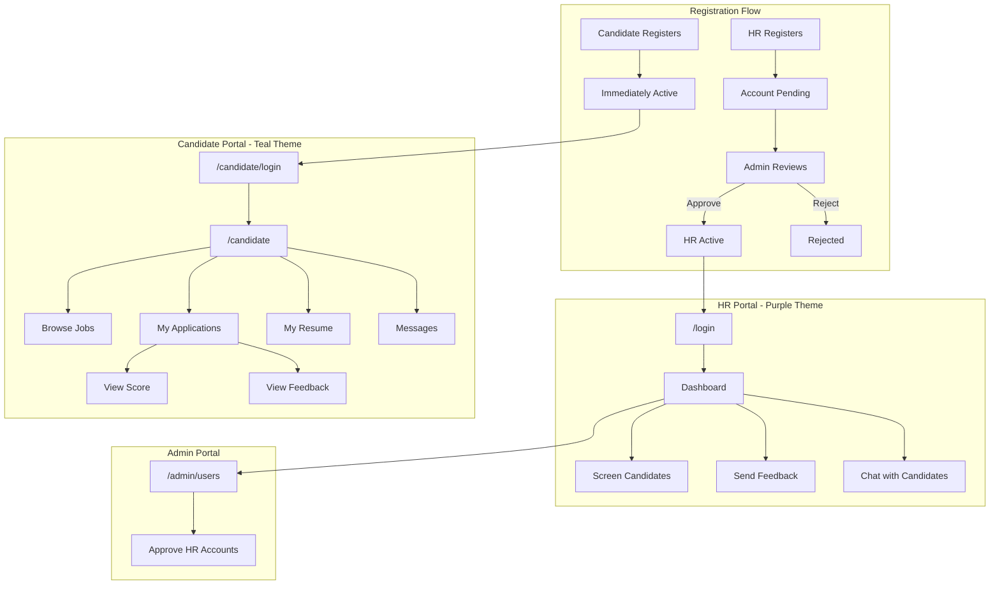
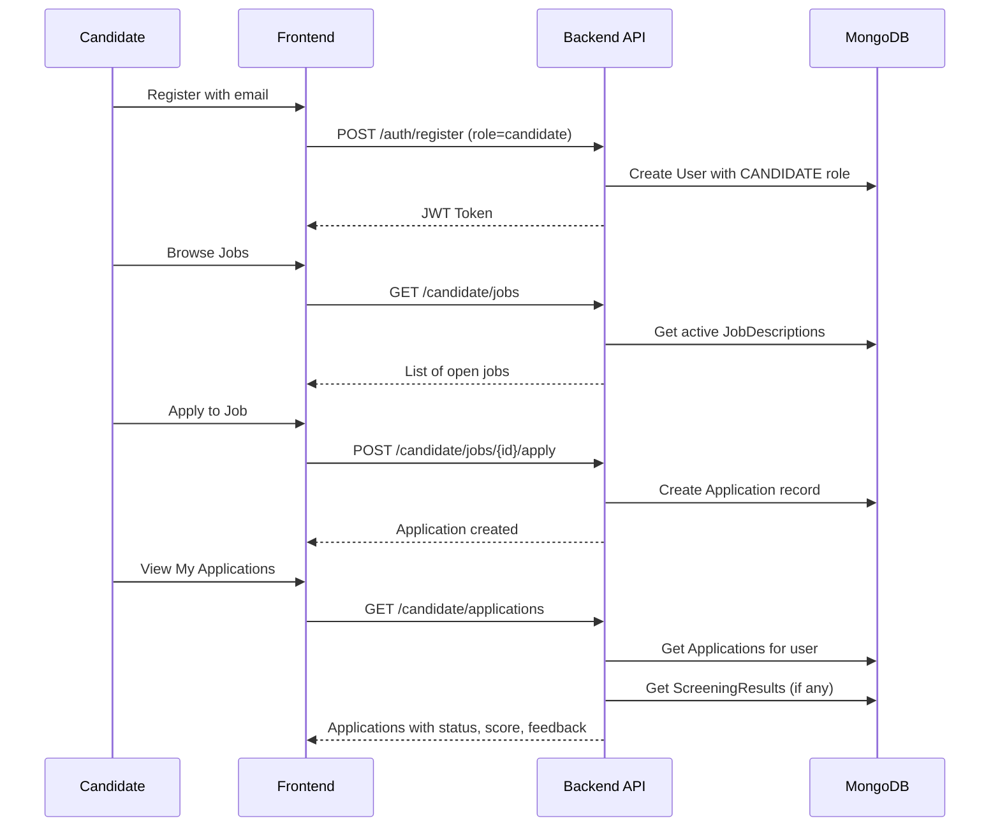

# HireQ Candidate Portal - Complete Implementation Plan

> **Status:** Planned (Not Implemented)  
> **Last Updated:** February 2026  
> **Estimated Scope:** Major Feature Addition

---

## Table of Contents

1. [Overview](#overview)
2. [Architecture](#architecture)
3. [UI Theme Design](#ui-theme-design)
4. [Backend Implementation](#backend-implementation)
   - [Phase 1: User Model Updates](#phase-1-user-model-updates)
   - [Phase 2: New Models](#phase-2-new-models)
   - [Phase 3: API Routes](#phase-3-api-routes)
5. [Frontend Implementation](#frontend-implementation)
   - [Phase 4: Tailwind Theme](#phase-4-tailwind-theme-setup)
   - [Phase 5: Candidate Portal](#phase-5-candidate-portal-new-app)
   - [Phase 6: Login Pages](#phase-6-login-pages)
   - [Phase 7: Admin Panel](#phase-7-admin-panel)
   - [Phase 8: HR Portal Updates](#phase-8-hr-portal-updates)
   - [Phase 9: State & API Client](#phase-9-state-and-api-client)
6. [File Structure Summary](#file-structure-summary)
7. [Security Considerations](#security-considerations)
8. [Testing Checklist](#testing-checklist)

---

## Overview

Build a **complete candidate-facing application** with distinct teal/cyan UI theme, separate from the existing HR portal. This is essentially a second app within the same codebase.

### Candidate Features
- Browse and apply to open jobs
- Track application status with visual timeline
- View match scores (transparency - HR controlled)
- Upload and manage resume
- View HR feedback
- Chat/message with HR recruiters

### HR/Admin Features
- Admin approval required for new HR accounts
- Send feedback to candidates
- Chat with candidates
- Control score visibility per candidate

### Registration Flow
| User Type | On Register | Account Status | Can Login? |
|-----------|-------------|----------------|------------|
| Candidate | Immediately active | `approved` | Yes |
| HR/Recruiter | Pending approval | `pending` | No (until admin approves) |
| Admin | N/A (created manually) | `approved` | Yes |

---

## Architecture

### System Flow Diagram



### Data Flow - Candidate Application



---

## UI Theme Design

| Portal | Primary Color | Gradient | Accent | Target Users |
|--------|--------------|----------|--------|--------------|
| HR Portal | Purple (`primary-500`) | Purple to Pink | Violet | Recruiters, HR Managers |
| Candidate Portal | Teal (`candidate-500`) | Teal to Cyan | Emerald | Job Applicants |
| Admin Portal | Slate | Gray to Slate | Blue | System Administrators |

### Portal Comparison

| Feature | HR Portal | Candidate Portal |
|---------|-----------|------------------|
| Login URL | `/login` | `/candidate/login` |
| Dashboard | `/dashboard` | `/candidate` |
| Navigation | Upload, Jobs, Results, Interviews, Dashboard | Dashboard, Jobs, Applications, Resume, Messages |
| Branding | "HireQ - Recruiter Portal" | "HireQ - Track Your Career" |
| Color Theme | Purple gradients | Teal/Cyan gradients |

---

## Backend Implementation

### Phase 1: User Model Updates

**File:** `backend/app/models/user.py`

#### Add CANDIDATE Role

```python
class UserRole(str, Enum):
    HR_MANAGER = "hr_manager"
    ADMIN = "admin"
    VIEWER = "viewer"
    CANDIDATE = "candidate"  # NEW
```

#### Add Account Status

```python
class AccountStatus(str, Enum):
    PENDING = "pending"
    APPROVED = "approved"
    REJECTED = "rejected"

class User(Document):
    # ... existing fields ...
    account_status: AccountStatus = Field(default=AccountStatus.APPROVED)
    rejection_reason: Optional[str] = None  # If rejected by admin
```

#### Update Auth Routes

**File:** `backend/app/routes/auth.py`

```python
# Role-checking utility
def require_role(*roles: UserRole):
    async def dependency(user: User = Depends(get_current_user)):
        if user.role not in roles:
            raise HTTPException(403, "Insufficient permissions")
        return user
    return dependency

# Convenience dependencies
require_hr = require_role(UserRole.HR_MANAGER, UserRole.ADMIN)
require_candidate = require_role(UserRole.CANDIDATE)
require_admin = require_role(UserRole.ADMIN)
```

**Registration Logic:**
- If `role == CANDIDATE`: `account_status = APPROVED`, `is_active = True`
- If `role == HR_MANAGER`: `account_status = PENDING`, `is_active = False`

**Login Logic:**
- Check `account_status`:
  - `PENDING`: Return error "Your account is pending admin approval"
  - `REJECTED`: Return error "Your account was rejected: {reason}"
  - `APPROVED`: Allow login

---

### Phase 2: New Models

#### 2.1 Update ScreeningResult Model

**File:** `backend/app/models/screening.py`

```python
class ScreeningResult(Document):
    # ... existing fields ...
    candidate_feedback: Optional[str] = None      # Visible to candidate
    internal_notes: Optional[str] = None          # HR-only notes
    feedback_sent_at: Optional[datetime] = None
    score_visible_to_candidate: bool = True       # HR can hide score
```

#### 2.2 Create Application Model

**New File:** `backend/app/models/application.py`

```python
from beanie import Document
from pydantic import Field
from typing import Optional, List
from datetime import datetime
from enum import Enum


class ApplicationStatus(str, Enum):
    APPLIED = "applied"
    SCREENING = "screening"
    INTERVIEW = "interview"
    OFFER = "offer"
    REJECTED = "rejected"
    HIRED = "hired"
    WITHDRAWN = "withdrawn"


class StatusChange(BaseModel):
    """Record of a status change for timeline."""
    from_status: Optional[str]
    to_status: str
    changed_at: datetime
    changed_by: Optional[str]  # User ID
    note: Optional[str]


class Application(Document):
    """Tracks a candidate's application to a job."""
    
    candidate_id: str = Field(...)      # User ID of candidate
    job_id: str = Field(...)            # JobDescription ID
    resume_id: Optional[str] = None     # Resume ID (if uploaded)
    
    status: ApplicationStatus = Field(default=ApplicationStatus.APPLIED)
    applied_at: datetime = Field(default_factory=datetime.utcnow)
    
    # Status timeline
    status_history: List[StatusChange] = []
    
    # Link to screening result (created when HR screens)
    screening_result_id: Optional[str] = None
    
    class Settings:
        name = "applications"
        indexes = [
            "candidate_id",
            "job_id",
            "status",
            "applied_at",
        ]
```

#### 2.3 Create Message Model

**New File:** `backend/app/models/message.py`

```python
from beanie import Document
from pydantic import BaseModel, Field
from typing import Optional
from datetime import datetime


class Message(Document):
    """Individual chat message."""
    
    conversation_id: str = Field(...)
    sender_id: str = Field(...)
    receiver_id: str = Field(...)
    content: str = Field(...)
    
    sent_at: datetime = Field(default_factory=datetime.utcnow)
    read_at: Optional[datetime] = None
    
    class Settings:
        name = "messages"
        indexes = [
            "conversation_id",
            "sender_id",
            "sent_at",
        ]


class Conversation(Document):
    """Chat conversation between HR and Candidate."""
    
    hr_user_id: str = Field(...)
    candidate_user_id: str = Field(...)
    job_id: Optional[str] = None  # Context: which job application
    
    last_message_at: datetime = Field(default_factory=datetime.utcnow)
    last_message_preview: Optional[str] = None
    
    unread_count_hr: int = 0
    unread_count_candidate: int = 0
    
    class Settings:
        name = "conversations"
        indexes = [
            "hr_user_id",
            "candidate_user_id",
            "last_message_at",
        ]
```

---

### Phase 3: API Routes

#### 3.1 Candidate Routes

**New File:** `backend/app/routes/candidate.py`

| Endpoint | Method | Description |
|----------|--------|-------------|
| `/api/candidate/jobs` | GET | List all open jobs (public) |
| `/api/candidate/jobs/{id}` | GET | Get job details |
| `/api/candidate/jobs/{id}/apply` | POST | Apply to a job |
| `/api/candidate/applications` | GET | List my applications |
| `/api/candidate/applications/{id}` | GET | Get application details with score/feedback |
| `/api/candidate/applications/{id}/withdraw` | POST | Withdraw application |
| `/api/candidate/resume` | GET | Get my current resume |
| `/api/candidate/resume` | POST | Upload/update resume |
| `/api/candidate/profile` | GET/PUT | View/update profile |

**Key Implementation - Link candidates to existing resumes:**

```python
@router.get("/applications")
async def get_my_applications(current_user: User = Depends(require_candidate)):
    # Get applications created by this user
    applications = await Application.find(
        Application.candidate_id == str(current_user.id)
    ).to_list()
    
    # Also find resumes uploaded by HR that match candidate's email
    legacy_resumes = await Resume.find(
        Resume.parsed_data.email == current_user.email
    ).to_list()
    
    # Combine and return with screening results
```

#### 3.2 Messaging Routes

**New File:** `backend/app/routes/messaging.py`

| Endpoint | Method | Description |
|----------|--------|-------------|
| `/api/messages/conversations` | GET | List all conversations |
| `/api/messages/conversations/{id}` | GET | Get messages in conversation |
| `/api/messages/send` | POST | Send a message |
| `/api/messages/read/{conversation_id}` | POST | Mark messages as read |

#### 3.3 Admin Routes

**New File:** `backend/app/routes/admin.py`

| Endpoint | Method | Description |
|----------|--------|-------------|
| `/api/admin/users` | GET | List all users (with filters) |
| `/api/admin/users/pending` | GET | List pending HR accounts |
| `/api/admin/users/{id}/approve` | POST | Approve an HR account |
| `/api/admin/users/{id}/reject` | POST | Reject with reason |

```python
@router.post("/users/{user_id}/approve")
async def approve_user(
    user_id: str,
    current_user: User = Depends(require_admin)
):
    user = await User.get(user_id)
    if not user:
        raise HTTPException(404, "User not found")
    
    user.account_status = AccountStatus.APPROVED
    user.is_active = True
    await user.save()
    
    # TODO: Send email notification to user
    return {"message": "User approved successfully"}


@router.post("/users/{user_id}/reject")
async def reject_user(
    user_id: str,
    reason: str,
    current_user: User = Depends(require_admin)
):
    user = await User.get(user_id)
    if not user:
        raise HTTPException(404, "User not found")
    
    user.account_status = AccountStatus.REJECTED
    user.rejection_reason = reason
    user.is_active = False
    await user.save()
    
    # TODO: Send email notification to user
    return {"message": "User rejected"}
```

#### 3.4 HR Feedback Endpoint

**File:** `backend/app/routes/reports.py` (update)

```python
@router.post("/screening/{screening_id}/feedback")
async def send_candidate_feedback(
    screening_id: str,
    feedback: str,
    show_score: bool = True,
    current_user: User = Depends(require_hr)
):
    screening = await ScreeningResult.get(screening_id)
    if not screening:
        raise HTTPException(404, "Screening result not found")
    
    screening.candidate_feedback = feedback
    screening.feedback_sent_at = datetime.utcnow()
    screening.score_visible_to_candidate = show_score
    await screening.save()
    
    return {"message": "Feedback sent to candidate"}
```

#### 3.5 Register All Routes

**File:** `backend/app/routes/__init__.py`

```python
from app.routes import auth, resumes, jobs, interviews, reports, chat, realtime, candidate, messaging, admin

__all__ = [
    "auth",
    "resumes",
    "jobs",
    "interviews",
    "reports",
    "chat",
    "realtime",
    "candidate",   # NEW
    "messaging",   # NEW
    "admin",       # NEW
]
```

**File:** `backend/app/main.py`

```python
from app.routes import candidate, messaging, admin

# Add routers
app.include_router(candidate.router, prefix="/api/candidate", tags=["candidate"])
app.include_router(messaging.router, prefix="/api/messages", tags=["messaging"])
app.include_router(admin.router, prefix="/api/admin", tags=["admin"])
```

---

## Frontend Implementation

### Phase 4: Tailwind Theme Setup

**File:** `tailwind.config.ts`

Add candidate color palette:

```typescript
module.exports = {
  theme: {
    extend: {
      colors: {
        // Existing primary (purple) for HR
        primary: {
          50: '#faf5ff',
          // ... existing colors
        },
        
        // NEW: Candidate theme (teal/cyan)
        candidate: {
          50: '#f0fdfa',
          100: '#ccfbf1',
          200: '#99f6e4',
          300: '#5eead4',
          400: '#2dd4bf',
          500: '#14b8a6',  // Primary teal
          600: '#0d9488',
          700: '#0f766e',
          800: '#115e59',
          900: '#134e4a',
          950: '#042f2e',
        },
      },
    },
  },
}
```

---

### Phase 5: Candidate Portal (New App)

#### 5.1 Candidate Layout

**New File:** `app/candidate/layout.tsx`

- Wraps all `/candidate/*` routes
- Uses teal/cyan gradient theme
- Includes `CandidateNavbar` and `CandidateFooter`
- Auth check: redirect to `/candidate/login` if not authenticated as candidate

```typescript
'use client';

import { useEffect } from 'react';
import { useRouter } from 'next/navigation';
import { useStore } from '@/store/useStore';
import CandidateNavbar from '@/components/candidate/CandidateNavbar';
import CandidateFooter from '@/components/candidate/CandidateFooter';

export default function CandidateLayout({ children }: { children: React.ReactNode }) {
  const router = useRouter();
  const { user, isAuthenticated } = useStore();
  
  useEffect(() => {
    if (!isAuthenticated) {
      router.push('/candidate/login');
    } else if (user?.role !== 'candidate') {
      router.push('/dashboard'); // Redirect HR to their portal
    }
  }, [isAuthenticated, user, router]);
  
  return (
    <div className="min-h-screen bg-gradient-to-br from-candidate-50 to-cyan-50 dark:from-gray-950 dark:to-gray-900">
      <CandidateNavbar />
      <main className="pt-20">{children}</main>
      <CandidateFooter />
    </div>
  );
}
```

#### 5.2 Candidate Navbar

**New File:** `components/candidate/CandidateNavbar.tsx`

Navigation items:
- Dashboard (`/candidate`)
- Browse Jobs (`/candidate/jobs`)
- My Applications (`/candidate/applications`)
- My Resume (`/candidate/resume`)
- Messages (`/candidate/messages`)
- Profile dropdown

Design: Teal gradient background, clean minimal style

#### 5.3 Candidate Pages

| Page | Path | Description |
|------|------|-------------|
| Login | `/candidate/login` | Teal-themed login/register |
| Dashboard | `/candidate` | Overview: recent applications, messages, stats |
| Browse Jobs | `/candidate/jobs` | Grid of open positions with search/filter |
| Job Detail | `/candidate/jobs/[id]` | Full job description + Apply button |
| Applications | `/candidate/applications` | List all my applications with status |
| Application Detail | `/candidate/applications/[id]` | Timeline, score, feedback |
| My Resume | `/candidate/resume` | Upload/view/update resume |
| Messages | `/candidate/messages` | Chat interface with HR |
| Profile | `/candidate/profile` | Account settings |

#### 5.4 Key UI Components

Create in `components/candidate/`:

| Component | Description |
|-----------|-------------|
| `CandidateNavbar.tsx` | Teal-themed navigation bar |
| `CandidateFooter.tsx` | Footer with candidate-focused links |
| `ApplicationCard.tsx` | Card showing application status |
| `ApplicationTimeline.tsx` | Visual status progression (Applied → Screening → Interview → Offer/Rejected) |
| `JobCard.tsx` | Job listing card with apply button |
| `ScoreDisplay.tsx` | Visual match score (circular progress) |
| `FeedbackDisplay.tsx` | HR feedback with timestamp |
| `ChatInterface.tsx` | Messaging UI |

---

### Phase 6: Login Pages

#### 6.1 HR Login Updates

**File:** `app/login/page.tsx` (update existing)

Changes:
- On register: pass `role: 'hr_manager'`
- Handle pending state: Show "Account pending admin approval" message with nice UI
- Add cross-link: "Looking for a job? Candidate Portal" → `/candidate/login`

```typescript
// After registration attempt
if (error?.includes('pending')) {
  return (
    <div className="text-center p-6 bg-amber-50 dark:bg-amber-900/20 rounded-xl">
      <Clock className="h-12 w-12 text-amber-500 mx-auto mb-4" />
      <h3 className="text-lg font-semibold">Account Pending Approval</h3>
      <p className="text-gray-600 dark:text-gray-400 mt-2">
        Your recruiter account is being reviewed by an administrator.
        You'll receive an email once approved.
      </p>
    </div>
  );
}
```

#### 6.2 Candidate Login

**New File:** `app/candidate/login/page.tsx`

- Teal gradient left panel (instead of purple)
- Tagline: "Track Your Career Journey"
- Features listed: Browse Jobs, Track Applications, Get Feedback
- On register: pass `role: 'candidate'`
- Cross-link: "Are you a recruiter? HR Portal" → `/login`

---

### Phase 7: Admin Panel

#### 7.1 Admin Layout

**New File:** `app/admin/layout.tsx`

- Accessible only to `admin` role users
- Slate/gray theme
- Minimal navigation

#### 7.2 Admin Users Page

**New File:** `app/admin/users/page.tsx`

Features:
- Tabs: All Users | Pending Approval
- Table with columns: Name, Email, Role, Status, Created, Actions
- Actions: Approve (green button), Reject (red button with reason modal)
- Filters: by role, by status
- Search by name/email

---

### Phase 8: HR Portal Updates

#### 8.1 Update Results Page

**File:** `app/results/page.tsx` (update)

Add per-candidate:
- "Send Feedback" button → opens modal
- Feedback modal: text area + "Show score to candidate" checkbox
- "Feedback Sent" badge after sending
- "Message Candidate" button → opens chat

#### 8.2 HR Messaging UI

**New File:** `components/features/HRMessaging.tsx`

- Slide-out panel or dedicated page
- List of conversations with candidates
- Real-time chat interface
- Unread message indicators

#### 8.3 Update Navbar

**File:** `components/layout/Navbar.tsx` (update)

- Add "Messages" icon/link for HR (with unread badge)
- Add "Admin" link for admin users
- Keep existing nav for HR

---

### Phase 9: State and API Client

#### 9.1 Update Store

**File:** `store/useStore.ts` (update)

```typescript
// New interfaces
interface CandidateApplication {
  id: string;
  jobId: string;
  jobTitle: string;
  company: string;
  status: 'applied' | 'screening' | 'interview' | 'offer' | 'rejected' | 'hired' | 'withdrawn';
  appliedAt: string;
  score?: number;
  scoreVisible?: boolean;
  feedback?: string;
  feedbackAt?: string;
}

interface ChatMessage {
  id: string;
  senderId: string;
  content: string;
  sentAt: string;
  isRead: boolean;
}

interface ChatConversation {
  id: string;
  otherUser: { id: string; name: string; };
  jobTitle?: string;
  lastMessage: string;
  lastMessageAt: string;
  unreadCount: number;
}

// Add to store state
interface StoreState {
  // ... existing state ...
  
  // Candidate portal state
  candidateApplications: CandidateApplication[];
  setCandidateApplications: (apps: CandidateApplication[]) => void;
  
  // Messaging state
  conversations: ChatConversation[];
  currentConversation: ChatMessage[];
  setConversations: (convs: ChatConversation[]) => void;
  setCurrentConversation: (msgs: ChatMessage[]) => void;
  addMessage: (msg: ChatMessage) => void;
}
```

#### 9.2 Update API Client

**File:** `lib/api.ts` (update)

```typescript
// ==================== Authentication ====================

export async function registerWithRole(
  data: RegisterData, 
  role: 'hr_manager' | 'candidate'
): Promise<AuthResponse> {
  const response = await apiRequest<AuthResponse>('/auth/register', {
    method: 'POST',
    body: JSON.stringify({ ...data, role }),
  });
  setAuthToken(response.access_token);
  return response;
}

// ==================== Candidate Portal ====================

export async function getOpenJobs(): Promise<JobDescriptionResponse[]> {
  return apiRequest('/candidate/jobs');
}

export async function getJobDetail(id: string): Promise<JobDescriptionResponse> {
  return apiRequest(`/candidate/jobs/${id}`);
}

export async function applyToJob(
  jobId: string, 
  resumeId?: string
): Promise<{ id: string; status: string }> {
  return apiRequest(`/candidate/jobs/${jobId}/apply`, {
    method: 'POST',
    body: JSON.stringify({ resume_id: resumeId }),
  });
}

export async function getMyApplications(): Promise<CandidateApplication[]> {
  return apiRequest('/candidate/applications');
}

export async function getApplicationDetail(id: string): Promise<ApplicationDetail> {
  return apiRequest(`/candidate/applications/${id}`);
}

export async function withdrawApplication(id: string): Promise<void> {
  await apiRequest(`/candidate/applications/${id}/withdraw`, { method: 'POST' });
}

export async function uploadMyResume(file: File): Promise<ResumeResponse> {
  const formData = new FormData();
  formData.append('file', file);
  
  const token = getAuthToken();
  const response = await fetch(`${API_BASE_URL}/candidate/resume`, {
    method: 'POST',
    headers: { 'Authorization': `Bearer ${token}` },
    body: formData,
  });
  
  if (!response.ok) throw new Error('Upload failed');
  return response.json();
}

export async function getMyResume(): Promise<ResumeResponse | null> {
  return apiRequest('/candidate/resume');
}

// ==================== Messaging ====================

export async function getConversations(): Promise<Conversation[]> {
  return apiRequest('/messages/conversations');
}

export async function getMessages(conversationId: string): Promise<Message[]> {
  return apiRequest(`/messages/conversations/${conversationId}`);
}

export async function sendMessage(
  receiverId: string, 
  content: string,
  jobId?: string
): Promise<Message> {
  return apiRequest('/messages/send', {
    method: 'POST',
    body: JSON.stringify({ receiver_id: receiverId, content, job_id: jobId }),
  });
}

export async function markMessagesAsRead(conversationId: string): Promise<void> {
  await apiRequest(`/messages/read/${conversationId}`, { method: 'POST' });
}

// ==================== Admin ====================

export async function getPendingUsers(): Promise<User[]> {
  return apiRequest('/admin/users/pending');
}

export async function getAllUsers(filters?: { role?: string; status?: string }): Promise<User[]> {
  const params = new URLSearchParams(filters as Record<string, string>);
  return apiRequest(`/admin/users?${params}`);
}

export async function approveUser(id: string): Promise<void> {
  await apiRequest(`/admin/users/${id}/approve`, { method: 'POST' });
}

export async function rejectUser(id: string, reason: string): Promise<void> {
  await apiRequest(`/admin/users/${id}/reject`, {
    method: 'POST',
    body: JSON.stringify({ reason }),
  });
}

// ==================== HR Feedback ====================

export async function sendCandidateFeedback(
  screeningId: string, 
  feedback: string, 
  showScore: boolean = true
): Promise<void> {
  await apiRequest(`/reports/screening/${screeningId}/feedback`, {
    method: 'POST',
    body: JSON.stringify({ feedback, show_score: showScore }),
  });
}
```

---

## File Structure Summary

### Backend - New Files

```
backend/app/
├── models/
│   ├── user.py              # UPDATE: Add CANDIDATE role, AccountStatus
│   ├── screening.py         # UPDATE: Add feedback fields
│   ├── application.py       # NEW: Application tracking
│   └── message.py           # NEW: Chat messages & conversations
├── routes/
│   ├── __init__.py          # UPDATE: Register new routes
│   ├── auth.py              # UPDATE: Role checking, registration logic
│   ├── reports.py           # UPDATE: Add feedback endpoint
│   ├── candidate.py         # NEW: Candidate API
│   ├── messaging.py         # NEW: Chat API
│   └── admin.py             # NEW: Admin API
└── main.py                  # UPDATE: Include new routers
```

### Frontend - New Files

```
app/
├── candidate/
│   ├── layout.tsx                    # NEW: Candidate layout
│   ├── page.tsx                      # NEW: Candidate dashboard
│   ├── login/
│   │   └── page.tsx                  # NEW: Candidate login
│   ├── jobs/
│   │   ├── page.tsx                  # NEW: Browse jobs
│   │   └── [id]/
│   │       └── page.tsx              # NEW: Job detail
│   ├── applications/
│   │   ├── page.tsx                  # NEW: My applications
│   │   └── [id]/
│   │       └── page.tsx              # NEW: Application detail
│   ├── resume/
│   │   └── page.tsx                  # NEW: Resume management
│   ├── messages/
│   │   └── page.tsx                  # NEW: Chat with HR
│   └── profile/
│       └── page.tsx                  # NEW: Profile settings
├── admin/
│   ├── layout.tsx                    # NEW: Admin layout
│   └── users/
│       └── page.tsx                  # NEW: User management
└── login/
    └── page.tsx                      # UPDATE: Add pending state, candidate link

components/
├── candidate/                        # NEW: Candidate-specific components
│   ├── CandidateNavbar.tsx
│   ├── CandidateFooter.tsx
│   ├── ApplicationCard.tsx
│   ├── ApplicationTimeline.tsx
│   ├── JobCard.tsx
│   ├── ScoreDisplay.tsx
│   ├── FeedbackDisplay.tsx
│   └── ChatInterface.tsx
├── features/
│   └── HRMessaging.tsx              # NEW: HR chat component
└── layout/
    └── Navbar.tsx                   # UPDATE: Role-based nav

lib/
└── api.ts                           # UPDATE: Add new API functions

store/
└── useStore.ts                      # UPDATE: Add candidate state

tailwind.config.ts                   # UPDATE: Add candidate colors
```

---

## Security Considerations

### Authentication & Authorization
- JWT tokens include user ID; role is fetched from database on each request
- Role is set server-side during registration (cannot be spoofed)
- Every protected endpoint checks user role

### Data Access Control
- Candidates can ONLY see their own applications
- Candidates cannot see internal recruiter notes (`internal_notes`)
- Candidates cannot modify their application status
- Score visibility is controlled by HR (`score_visible_to_candidate`)

### Admin Controls
- Only admin users can access `/api/admin/*` endpoints
- Admin actions (approve/reject) should be logged
- Consider adding email verification for new accounts

### Rate Limiting
- Rate limit registration endpoint to prevent spam
- Rate limit messaging to prevent abuse

---

## Testing Checklist

### Registration & Login
- [ ] HR registration creates pending account (`is_active: false`, `account_status: pending`)
- [ ] Candidate registration creates active account immediately
- [ ] Pending HR sees "Account pending approval" message on login attempt
- [ ] Rejected HR sees rejection reason on login attempt
- [ ] Approved HR can login and access HR portal
- [ ] Candidate can login and is redirected to `/candidate`
- [ ] Wrong role redirect works (HR trying to access `/candidate` → `/dashboard`)

### Admin Functions
- [ ] Admin can view list of all users
- [ ] Admin can filter users by role/status
- [ ] Admin can view list of pending HR accounts
- [ ] Admin can approve HR account (sets `is_active: true`, `account_status: approved`)
- [ ] Admin can reject HR account with reason
- [ ] Non-admin users cannot access admin routes (403 error)

### Candidate Portal
- [ ] Candidate can browse open jobs
- [ ] Candidate can view job details
- [ ] Candidate can apply to a job
- [ ] Candidate can view their applications list
- [ ] Candidate can see application status timeline
- [ ] Candidate can see match score (if HR allowed visibility)
- [ ] Candidate CANNOT see score if HR disabled visibility
- [ ] Candidate can see HR feedback when provided
- [ ] Candidate can upload/update their resume
- [ ] Candidate can message HR
- [ ] Candidate cannot access HR portal routes (redirect to `/candidate`)

### HR Portal
- [ ] HR can send feedback to candidates
- [ ] HR can toggle score visibility per candidate
- [ ] HR can message candidates
- [ ] HR receives notifications for new applications
- [ ] HR can view all conversations in messaging UI

### Messaging
- [ ] Messages appear in real-time (or near real-time)
- [ ] Unread message counts update correctly
- [ ] Marking messages as read works
- [ ] Conversation history persists

### UI/UX
- [ ] Candidate portal uses teal/cyan theme
- [ ] HR portal uses purple theme
- [ ] Admin portal uses slate/gray theme
- [ ] Cross-links between portals work correctly
- [ ] Both portals are mobile responsive
- [ ] Dark mode works on both portals

---

## Implementation Priority

### Phase 1 (MVP)
1. Backend: User model updates (CANDIDATE role, AccountStatus)
2. Backend: Auth routes (role-based registration/login)
3. Frontend: Candidate login page
4. Frontend: Basic candidate dashboard
5. Backend: Admin routes (approve/reject)
6. Frontend: Admin users page

### Phase 2 (Core Features)
1. Backend: Application model
2. Backend: Candidate routes (jobs, applications)
3. Frontend: Browse jobs page
4. Frontend: Application detail page
5. Backend: Feedback fields in ScreeningResult
6. Frontend: HR feedback UI

### Phase 3 (Enhanced Features)
1. Backend: Message model
2. Backend: Messaging routes
3. Frontend: Candidate messaging
4. Frontend: HR messaging
5. Frontend: Resume management for candidates

### Phase 4 (Polish)
1. Email notifications
2. Real-time updates (WebSocket)
3. Mobile optimization
4. Performance optimization
5. Analytics/reporting

---

*End of Plan*
